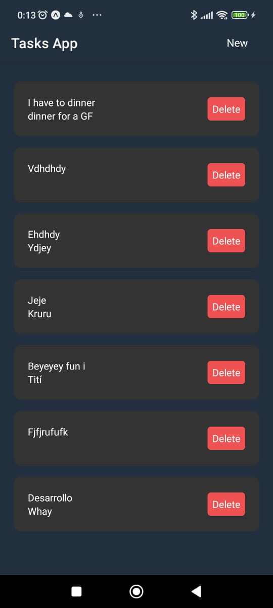

<!--
*** Thanks for checking out this README Template. If you have a suggestion that would
*** make this better, please fork the repo and create a pull request or simply open
*** an issue with the tag "enhancement".
*** Thanks again! Now go create something AMAZING! :D
-->

<!-- PROJECT SHIELDS -->
<!--
*** I'm using markdown "reference style" links for readability.
*** Reference links are enclosed in brackets [ ] instead of parentheses ( ).
*** See the bottom of this document for the declaration of the reference variables
*** for contributors-url, forks-url, etc. This is an optional, concise syntax you may use.
*** https://www.markdownguide.org/basic-syntax/#reference-style-links
-->

[![Contributors][contributors-shield]][contributors-url]
[![Forks][forks-shield]][forks-url]
[![Stargazers][stars-shield]][stars-url]
[![Issues][issues-shield]][issues-url]
[![MIT License][license-shield]][license-url]
[![LinkedIn][linkedin-shield]][linkedin-url]

<!-- PROJECT LOGO -->
 

    
  </a>

  <h3 align="center">App Tasks</h3>

  

    An awesome App to create tasks in your projects!
     
    <strong>Explore the docs »</strong></a>
     
     
    <a href="https://github.com/ErickEpnf18/react-native-tasks">View Demo</a>
    ·
    <a href="https://github.com/ErickEpnf18/react-native-tasks/issues">Report Bug</a>
    ·
    <a href="https://github.com/ErickEpnf18/react-native-tasks/issues">Request Feature</a>
  

<!-- TABLE OF CONTENTS -->

## Table of Contents

- [About the Project](#about-the-project)
  - [App ScreenShot](#app-screenshot)

<!-- ABOUT THE PROJECT -->

## About The Project

[![Product Name Screen Shot][product-screenshot]](https://example.com)

This project is done with express for backend and front-end development with React Native

Features to cover:

- Soon I'll go to increment more functinalities

<!-- ABOUT THE PROJECT -->

## App ScreenShot

    
    

